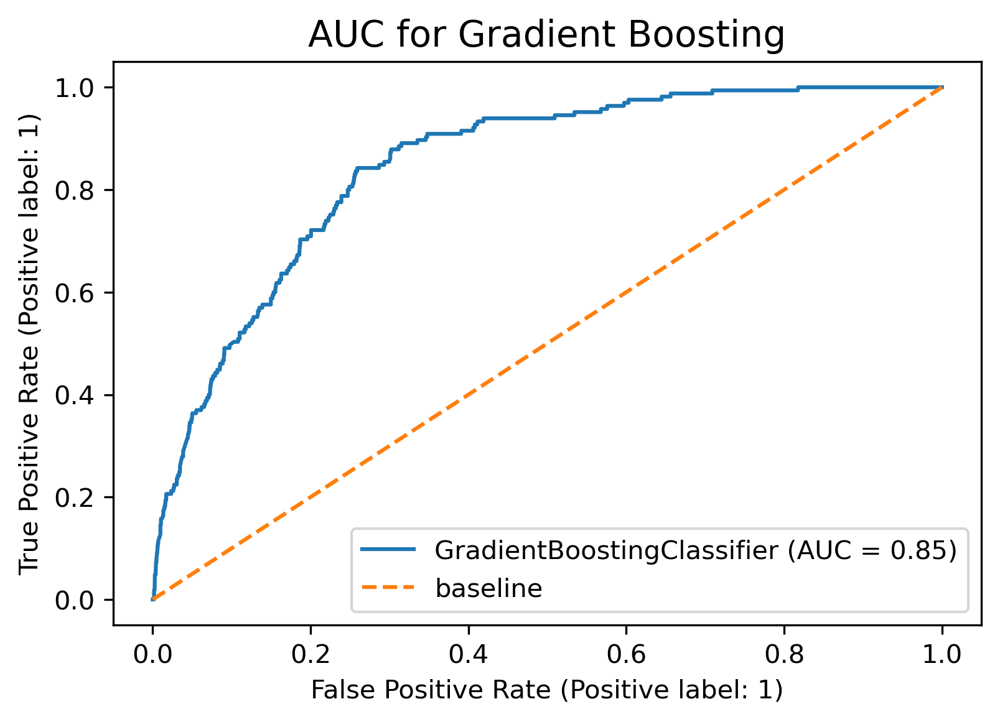
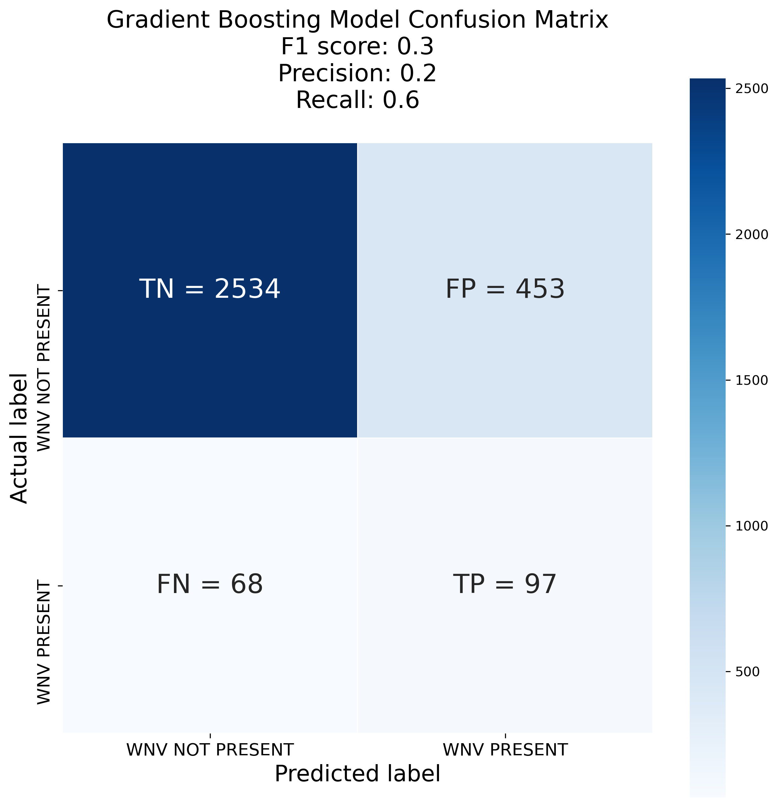

#  Project 4a: Predict West Nile Virus

## Problem Statement

This projects aim to use data science methods (classification modellings) to predict the places in Chicago where the West Nile Virus is present, with prediction having the higher AUC performance the better (as close to 1 as possible), so as to enable a more accurate and effective plan in deploying pesticides spraying throughout the state.

## Background

As data scientist of 5pm Disease and Treatment Agency, this project is done to be presented to members of Centre for Disease Control and Prevention (CDC) in the year 2015, so as to achieve objective as stated in problem statement.

#### West Nile Virus

West Nile virus (WNV) is a single-stranded RNA virus that causes West Nile fever. It is a member of the family Flaviviridae, from the genus Flavivirus, which also contains the Zika virus, dengue virus, and yellow fever virus. The virus is primarily transmitted by mosquitoes, mostly species of Culex. The primary hosts of WNV are birds, so that the virus remains within a "bird–mosquito–bird" transmission cycle.[1] The virus is genetically related to the Japanese encephalitis family of viruses.

Humans and horses both exhibit disease symptoms from the virus, and symptoms rarely occur in other animals. Identification of the human disease was first made in 1937 in Uganda and in the latter half of the 20th century spread to many other parts of the world.
https://en.wikipedia.org/wiki/West_Nile_virus

#### History of West Nile Virus

West Nile virus emerged in the United States in the New York metropolitan area in the fall of 1999. Since then, the virus, which can be transmitted to humans by the bite of an infected mosquito, has quickly spread across the country.

In 2002, WNV reached Chicago for the first time with 225 human cases reported that summer.

https://www.chicago.gov/content/dam/city/depts/cdph/food_env/general/West_Nile_Virus/WNV_2018databrief_FINALJan102019.pdf
https://www.dph.illinois.gov/topics-services/diseases-and-conditions/west-nile-virus

#### What the West Nile Virus does to birds

The United States crow population declined by 30% as a result of the introduction of WNV. There have also been significant declines in blue jays, American robins, eastern bluebirds, tufted titmice, house wrens, and chickadees. However by 2005, house wren and blue jay populations had already rebounded and returned to their pre-WNV levels.

West Nile Virus has been found in more than 250 species of birds, but crows, jays, and ravens are most susceptible to the disease. House sparrows, common grackles, house finches, Cooper's hawks, and red-tailed hawks are also more commonly infected species. Mammals can become infected, but often do not show clinical signs and are considered accidental hosts. Horses and humans appear more likely to develop clinical illness than other mammalian species. WNV has been reported in many wild mammals including caribou, chipmunks, squirrels, skunks, and wolves. Domestic mammals including cats, dogs, cattle, and sheep can become infected. The virus has also been isolated in reptiles and amphibians.

An Israeli strain of the virus was first isolated in North America in August 1999 in New York City. The virus was probably introduced to America via the transport of an infected mosquito by ship or airplane. It may also have been introduced via the import of an infected domestic bird or migration of an infected wild bird. Migrating birds played a major role in carrying the virus throughout the United States. Since its introduction, WNV has spread across the entire continental United States, and into Canada and Mexico. The virus was first found in Pennsylvania in 2000 in mosquitoes, birds, and a horse. Pennsylvania conducts continuous surveillance for the presence of WNV and publishes the data regularly on the United States Geological Survey website as well as the Pennsylvania West Nile Virus Control Program website.

West Nile Virus is most often transmitted in the bite of infected mosquitoes. Mosquitoes acquire the virus by blood feeding on infected birds. The mosquito can then transmit the virus to uninfected birds. Humans and other mammals can become infected by species of mosquitoes that feed on both birds and mammals. Mosquitoes in the Culex group primarily bite birds and are the most common carries of WNV, while Coquillettidia species bite both birds and mammals. Mammals are not known to produce enough viral particles in their blood to transmit WNV to mosquitoes, so they are considered dead-end hosts.

Mosquitoes are considered the primary mode of transmission. However, the virus may be able to spread from bird to bird in food or water that is contaminated with infected bodily secretions, and raptors may be able to acquire the virus by consuming infected birds. West Nile Virus can be transmitted from person to person via organ transplants, blood transfusions, and across the placenta, but it is not thought to be transmitted by direct contact.

Birds with West Nile Virus often show neurological signs including loss of coordination, head tilt, tremors, weakness, and lethargy. Most infected crows and jays will die within 3 weeks. Most mammals do not show clinical signs of this disease. Horses and humans are more likely than other mammals to develop a flu-like illness or signs of neurologic disease.
https://www.pgc.pa.gov/Wildlife/Wildlife-RelatedDiseases/Pages/WestNileVirus.aspx

#### Epizootic (Crow Death) preceds Epidemic (Human Death)
WNV-associated avian deaths have historically preceded human illness, and in Chicago, the epizootic peaked approximately 2 weeks before the human epidemic. Real-time analysis of incoming dead crow reports might be especially important because of the time lag between illness onset, confirmatory testing for WNV infection, report to the local health authority, and initiation of an epidemiologic case investigation to identify and adequately describe WNV-related human illness. In Chicago in 2002, the first case of WNV infection in a resident was reported on August 12, 13 days after the patient’s onset of illness.
https://wwwnc.cdc.gov/eid/article/10/5/03-0603_article

#### Farmer Markets - Places where people and birds will gather, especially during the summer months
Schedule
https://www.domu.com/blog/farmers-market-chicago

## Data Cleaning
The following cleaning processes were done on the following datasets:

- Train Dataset was very clean, not much cleaning was done, except to change the date object to a datetime datatype
- Test Dataset was very clean, not much cleaning was done, except to change the date object to a datetime datatype
- Spray Dataset was quite clean, there was 1 day where time was blank. The rows were removed as it only consisted of 4% of the datasets
- Weather Dataset required much cleaning. We imputed TAvg with average values form TMax and TMin and imputed the rest of the missing values with median values.

## Feature Engineering
The following features were engineered:

wet_dry: engineered from CodeSum as codesum consisted of object type abbreviations. Not all conditions were found in Chicago and we grouped the rest into wet or dry.

yearmonth and yearweek: engineered from year, month and week columns. We wanted to see the correlation between the weeks and months of each year to WNV presence.

## EDA
The following insights were found during EDA:  

1. There were not alot of traps found around the farmer markets area even though these were places people, birds and mosquitoes can gather.  
2. There were not alot of traps found around the high density residence area.  
3. Spraying did not seem very useful in eliminating mosquito population.

## Model Evaluations
The data used for the modelling is highly imbalanced, with 95% of the data indicating that the West Nile Virus is not present and only 5% of the data indicates that the virus is present. The Area Under Curve (AUC) value and F1-score was used for evaluation between the models while the Test and Train Accuracy score was compared within each model to check for overfitting or underfitting.

**Area Under Curve (AUC)**:
- Ability to distinguish between Positive (virus present) and Negative (virus not present)
- Good model = High AUC, closer to 1

**F1-score**:
- Weighted average of Precision-Recall score, used to compare the performance of classifiers
- Good model = High F1-score, closer to 1

**Train/Test Accuracy**:
- Overview of model’s ability to predict both majority and minority classes combined
- Accuracy score masks the model’s inability to correctly predict minority class when dealing with extremely imbalanced datasets
- In this project, will only use it to check if model is overfitting or underfitting
- Train > Test = Overfitting
- Train < Test = Underfitting

**The following models were ran and evaluated**:
1. Random Forest
2. Support Vector Classifier
3. Logistic Regression
4. Bernoulli Naive Bayes
5. Gradient Boosting
6. AdaBoost

|Different Model|AUC|Precision|Recall|F1-score|Train Accuracy|Test Accuracy|
|:---:|:---:|:---:|:---:|:---:|:---:|:---:|
|**Baseline**|-|-|-|-|-|0.950|
|**Random Forest**|0.805|0.219|0.333|0.264|0.940|0.938|
|**Support Vector Classification**|0.840|0.158|0.733|0.259|0.856|0.948|
|**Logistics Regression**|0.768|0.106|0.764|0.186|0.715|0.948|
|**Bernoulli Naive Bayes**|0.764|0.105|0.770|0.185|0.695|0.945|
|**Gradient Boosting**|**0.847**|0.176|0.588|**0.271**|0.900|0.942|
|**AdaBoost**|0.842|0.160|0.745|0.263|0.834|0.948|

Above is a table showing the summary of the scores of all the different models. The best model selected is the **Gradient Boosting model** as it scored the highest for both the AUC value and F1-score.

Slight underfitting can be seen since the Train Accuracy is lower then the Test Accuracy, so further hyperparameter tuning will be required. 

Overall, the models do not perform very well on the F1-score. This is likely due to the extremely imbalanced dataset. More data with West Nile Virus being present will be required to optimise the model and improve the scores.

## Cost-Benefit Analysis

**Cost Projection**

Based on the classification result of our selected model Gradient Boosting, we will take the percentage of TP, FN, and FP to assume the presence of WNV. This is to ensure all actual positives and predicted positives are covered.

Our test sample size = 3152
TP+FN+FP = 618  (20%)

Taking the total number of traps set up in 2013 about 80, we estimated that we only need to target 17 traps with radius of 2 km each, which will cover about an area of 12.56 km2*.  

Cost of Pesticide: USD 227.24 per km2
Targeted area of Chicago: 213.5 km2
~ USD 48, 516 each time, 
~ USD 485,160  twice a month for 5mths in a year

**Benefit Projection**

If the West Nile Virus is eliminated, or significantly reduced with effective approaches, this will certainly give the residents a peace of mind.

Quality of Life:
- Fewer people falling ill or dying
- Higher productivity at work

Reduced risk of monetary loss:
- Hospital bill can be avoided, estimated $25K per patient
- Loss of income or labour during recovery ~ $1.5K/patient* can be saved
- The cost of spraying of $485K/year is about 20 persons’ monetary loss. In an epidemic, usually will be a larger populated gets infected.

Eliminate Fear of Body Damage:
- Prolonged fatigue
- Severe neuro-invasive diseases, such as meningitis
(Peterson, 2019)

## Conclusion

If calcualte the cost per population of 2.71 million, based on our targeted-area cost estimated above, it only takes USD 0.18 per person annually, which is a relatively small amount of money.

As shown in our cost-benefit analysis, the cost per infection and the overall well being of the city outweigh the total cost of spray.  Spraying is necessary, it instills confidence and a peace of mind, at the minimum..

Should there be an outbreak of virus, people would be subjected to mental health illness, or even death, as there is no effective medication.

## Recommendation

1. Further hyperparameters tuning of the model. More data is required, preferably a more balanced dataset.
2. Explore other modelling techniques.
3. Lavriciding technique by using biological pesticides, chemicals or fish to kill mosquito larvae in waters before they hatch.
4. Explore Wolbachia (Singapore) Mosquito Suppression Strategy (with care). When male Wolbachia-carrying Aedes aegypti (Wolbachia-Aedes) mosquitoes mate with urban female Aedes aegypti that do not carry Wolbachia, their resulting eggs do not hatch.
5. More traps to be placed near Farmer Market - areas where birds and humans would gather, thereby drawing mosquitoes, especially in the summer.

